# REIGN — E-Commerce Platform


Modern full-stack e-commerce platform built with React, Node.js, Express, PostgreSQL, and Stripe. The application provides a complete online shopping experience with authentication, product management, shopping cart functionality, secure payments, order tracking, reviews, and an administrative dashboard.

## Screenshots

### Homepage
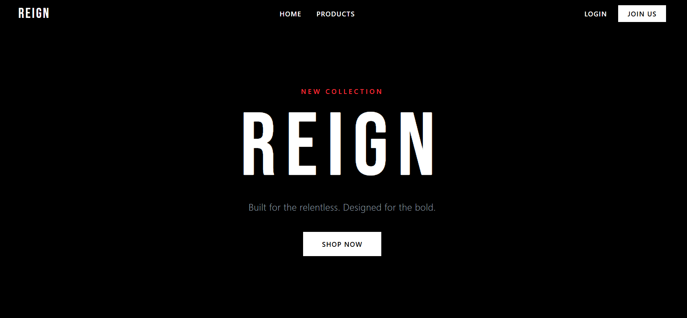
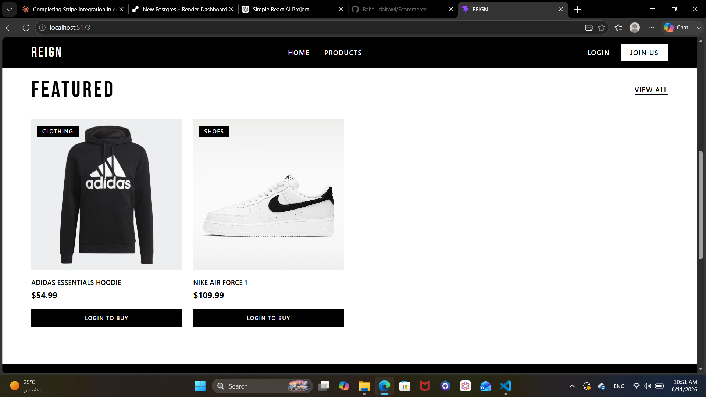

### Products
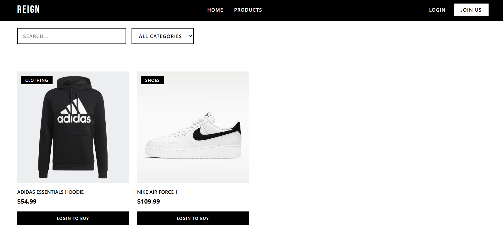

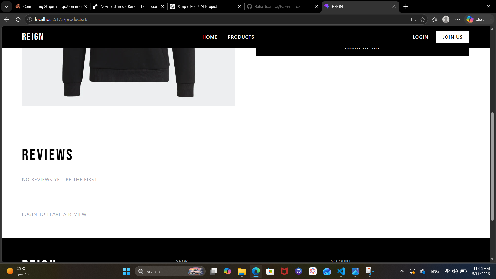

### Authentication
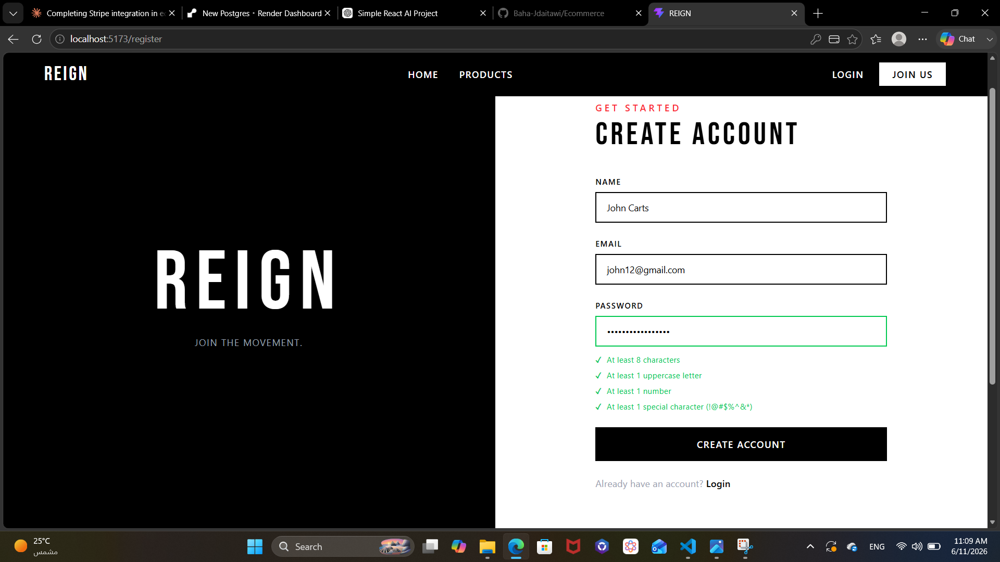
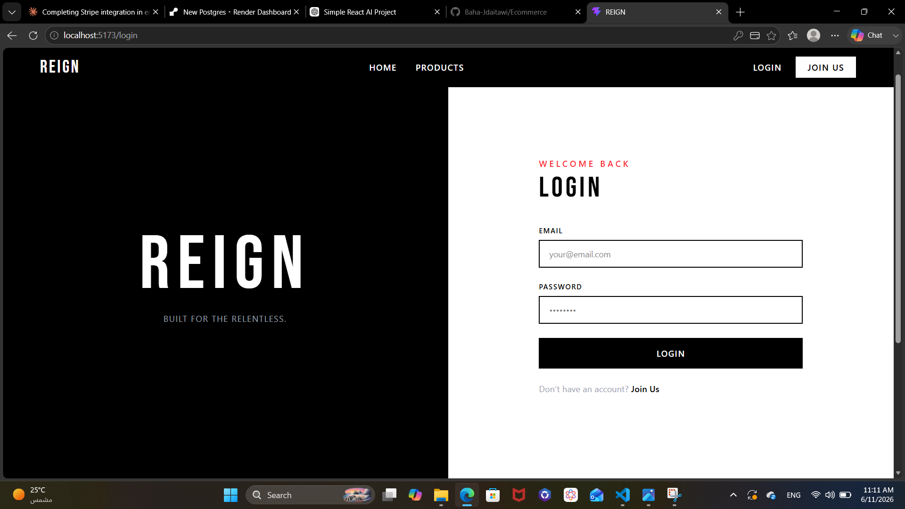

### Shopping
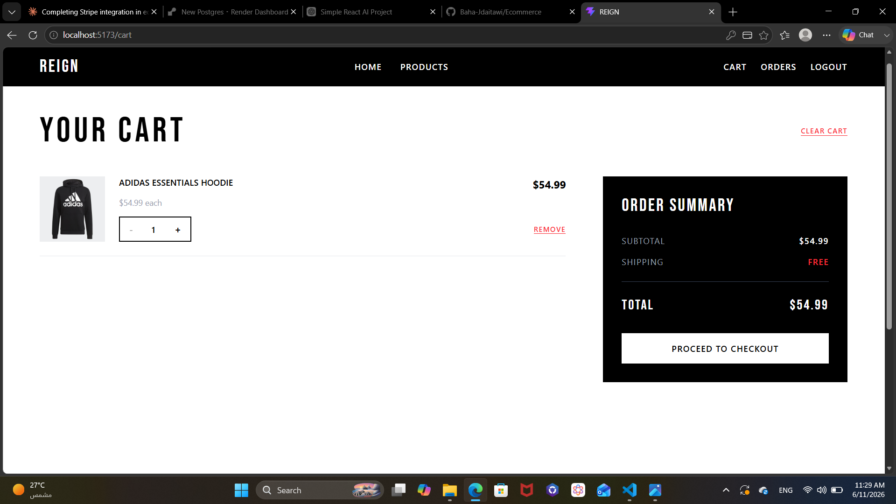
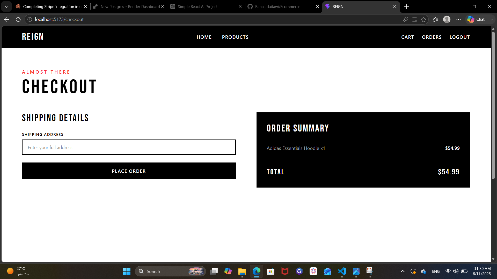
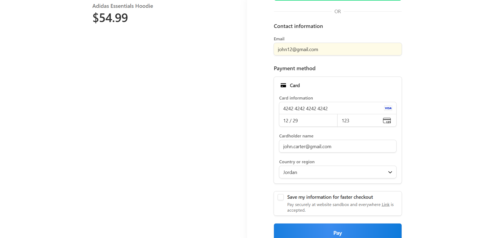
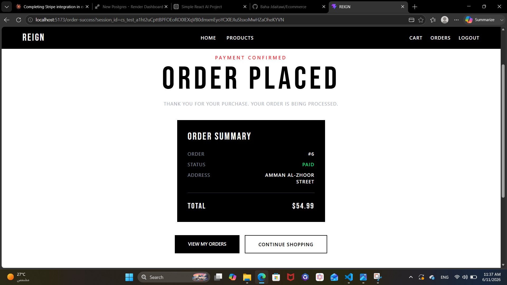

### Orders
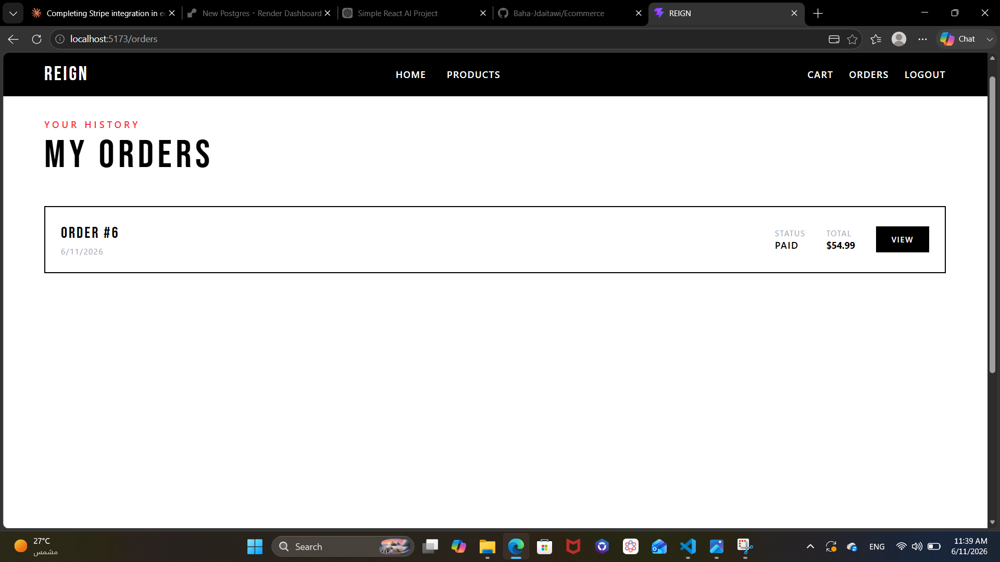
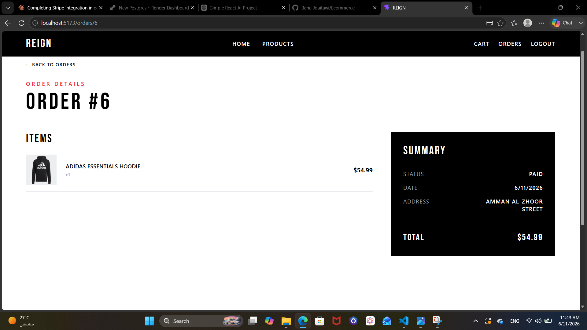

### Admin
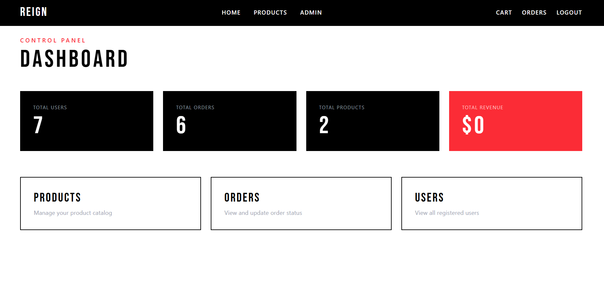
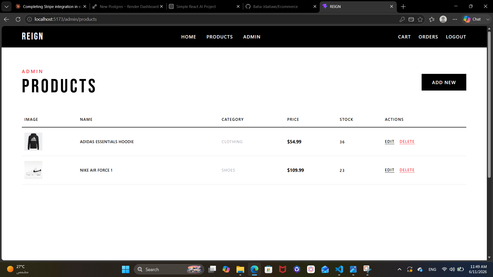
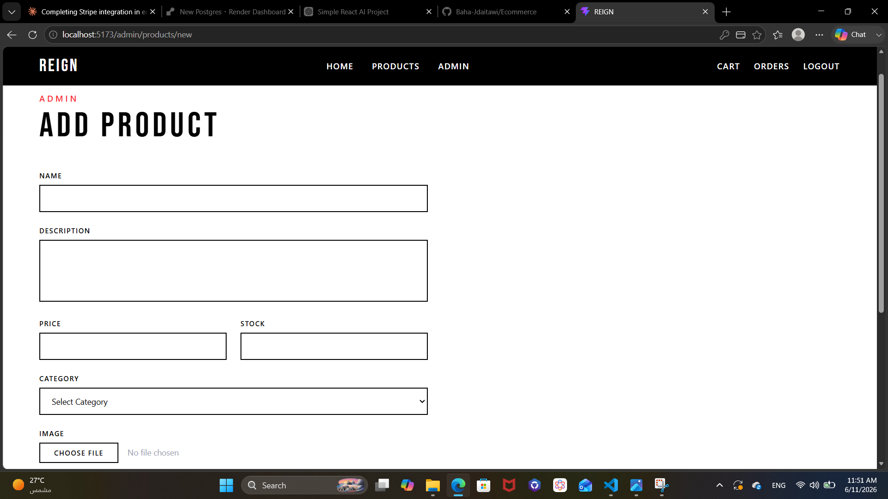
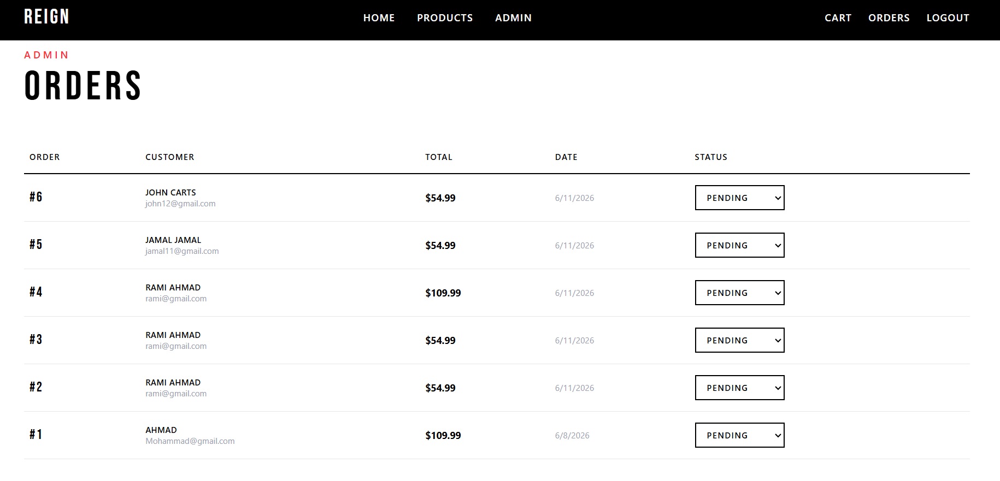
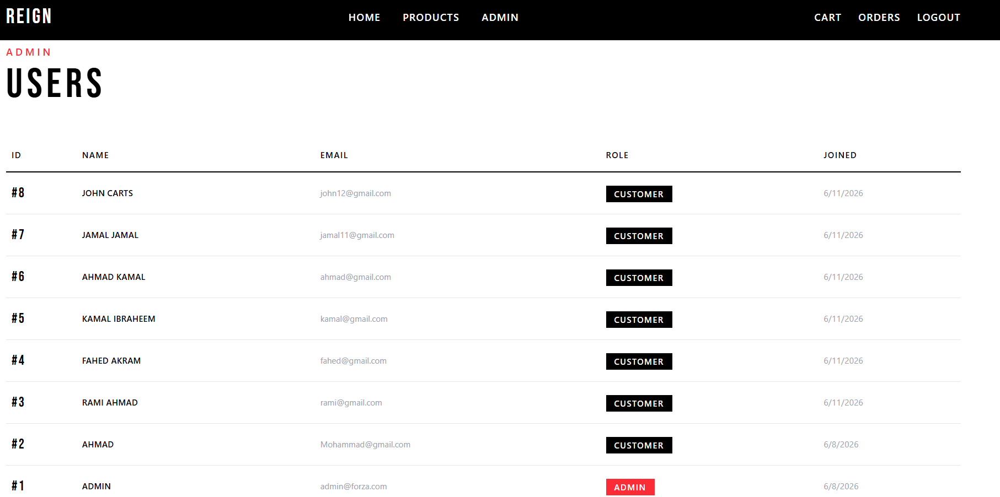

## Features

### Authentication & Authorization
- User registration and login with password validation
- JWT authentication with HTTP-only cookie-based sessions
- Role-based access control (admin/customer)
- Protected and admin-only routes
- Persistent authentication state

### Product Management
- Product catalog with search and category filtering
- Product detail pages with stock display
- Product image uploads via Multer
- Admin product CRUD operations

### Shopping Cart
- Add, update, and remove items
- Real-time total calculation
- In-cart state indicator on product cards
- Clear cart functionality

### Orders & Payments
- Stripe Checkout integration
- Webhook-based order confirmation
- Order creation and tracking
- Order history and detail view
- Admin order status management

### Reviews
- Product star ratings and comments
- One review per user per product
- Admin review moderation

### Admin Dashboard
- Revenue, orders, users, and products stats
- Product, order, and user management

## Tech Stack

### Frontend
- React
- React Router
- Axios
- Tailwind CSS
- Context API

### Backend
- Node.js
- Express.js
- PostgreSQL
- JWT
- bcrypt
- Multer
- Stripe

## Architecture

### Frontend
Feature-Driven Architecture — each feature contains its own pages, components, hooks, services, and API layer.

- Authentication
- Products
- Cart
- Orders
- Reviews
- Admin

### Backend
Layered Architecture

- Routes
- Controllers
- Middleware
- Models
- Database Migrations
- Configuration

## Database

PostgreSQL relational database managed through migration-based schema versioning to ensure consistent and maintainable database changes across environments.

### Core Entities
- Users
- Products
- Cart
- Orders & Order Items
- Reviews

## Setup

### Prerequisites
- Node.js
- PostgreSQL
- Stripe account

### Backend
```bash
cd Backend
npm install
npm run migrate
npm run dev
```

### Frontend
```bash
cd Frontend
npm install
npm run dev
```

### Stripe Webhook (local development)
```bash
./stripe listen --forward-to localhost:5000/api/orders/webhook
```


